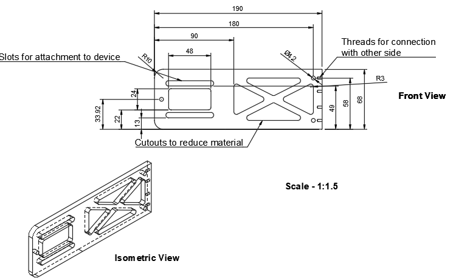
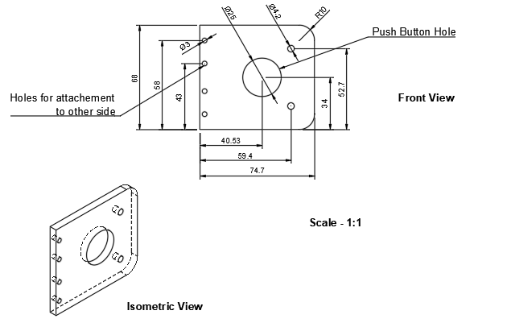
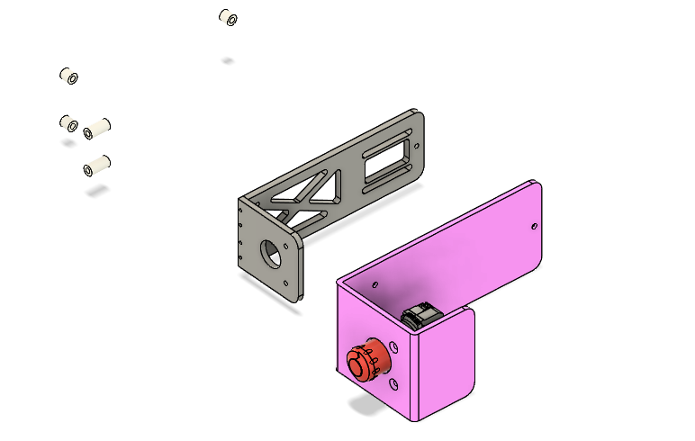
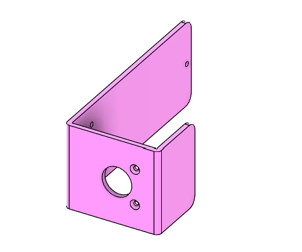
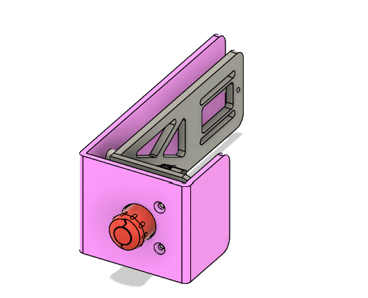
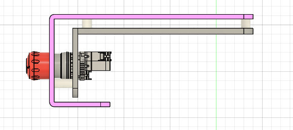
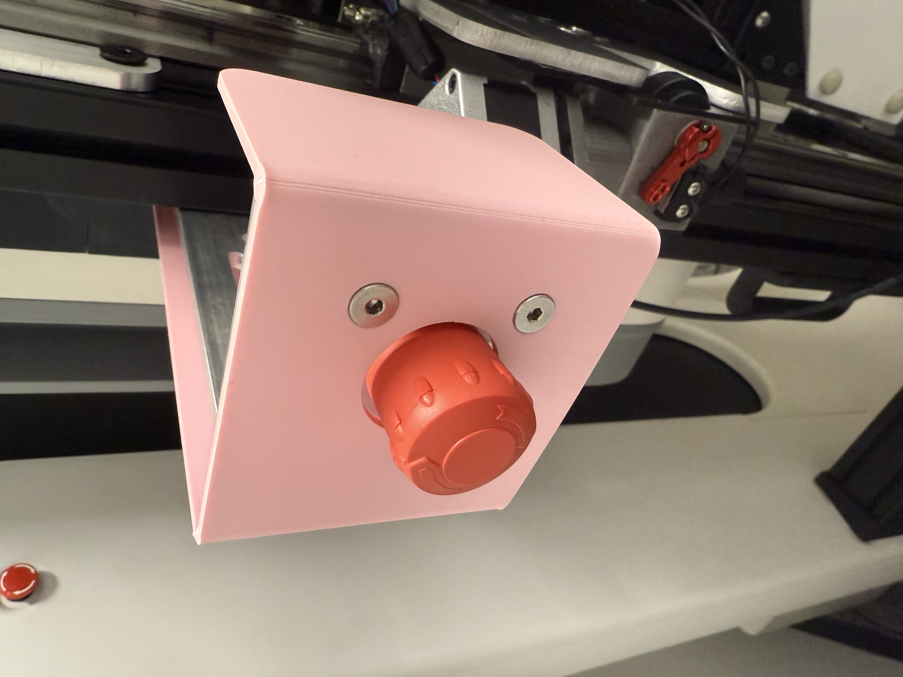

# Emergency Stop Button Enclosure

This project documents the design and implementation of a custom CNC-machined housing for an emergency stop button. The machine that required this button needed both functional and aesthetic considerations: a rigid aluminum enclosure to resist mechanical stress and a sleek appearance with no protruding components. To achieve this, I designed an L-shaped enclosure made from two interlocking aluminum components, with an acrylic cover panel mounted via standoffs. This allowed the button to remain accessible while cleanly hiding the electronics and mounting features.

---

## 📐 CAD Drawings

### 🔧 Long Aluminum Side

Displays front and isometric views of the longer aluminum enclosure side.

- **Mounting slots** for attachment to device  
- **Material-reducing cutouts** to lower weight while retaining stiffness  
- **Threaded holes** for bolting to the short side  

---

### 🔧 Short Aluminum Side

Front and isometric views of the shorter L-shaped side that directly holds the emergency stop button.

- **Circular cutout** to house the emergency stop pushbutton  
- **Mounting holes** to interface with the long aluminum side  
- Curved corner design for **manufacturability** and **safety**

### 🔧 Exploded View

Exploded view for visualization of where pieces connect.

---

## 🧩 Assembly and Cover

### 🟪 Acrylic Cover – Isometric View

Isometric view of the acrylic cover plate mounted via standoffs. This component hides the internal electronics and fasteners, leaving only the emergency stop button visible.

- **Attached via standoffs** to the aluminum housing  
- **Offset geometry** aligns precisely with the base housing  
- Ensures a **minimalist and professional look**

---

### 🧱 Full Assembly – Isometric View

Shows the complete system including the button, housing, and cover panel.

- Button face is **flush-mounted** with acrylic cover  
- Cables and fasteners are **fully enclosed**  
- All parts designed for **CNC machinability** and **repeatability**

---

### 📏 Top-Down View – Standoff Alignment

Top-down layout showing alignment of aluminum enclosure and acrylic cover via cylindrical standoffs.

- **Standoffs precisely located** for even panel spacing  
- Ensures **easy disassembly** for maintenance  
- No interference with button action or cable routing  

---

## 🛠️ Design Considerations

- **Material**: Aluminum was selected for the enclosure due to its high strength-to-weight ratio and machinability. Acrylic was chosen for the cover for aesthetic purposes and electrical insulation.
- **Manufacturability**: The enclosure is split into two parts for ease of CNC machining and assembly.
- **Aesthetics**: The L-shaped design and offset acrylic panel create a clean, concealed final appearance with minimal visual clutter.
- **Robustness**: Threaded connections and tight tolerances ensure the structure remains secure even under mechanical impact.
